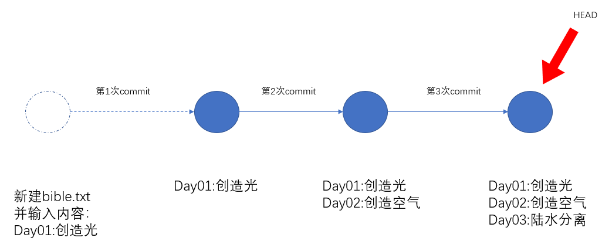

# git讲义

## git的作用

## 版本管理

版本控制（Version control）:学习它，爱上它，享受它。顾名思义，**版本控制系统是任何能让你了解到一个文件的历史，以及它的发展过程的系统。**

设计稿

- 201906011初稿.doc
- 201906013初稿-带目录.doc
- 201906016修正稿-带目录和页码.doc
- 201906018修正稿（导师二次修改）-带目录和页码.doc
- 201906020最终版.doc
- 201906022最终版（导师提了几个要求）.doc
- 201906022最终版（打死不改版）.doc
- 201906023最终版（打印店）.doc
- 201906024最终版（加上参考文献及边距）.doc

## git中的基本概念

**Git 是一种专为处理文本文件而设计的版本控制系统。**

注意：只对文本文件。我们的代码恰好就是文本文件。换句话说，如果你希望记录视频文件的修改过程，git是不能帮助你的。

## 登记

在使用git之前，你可能需要进行登记。这个也比较好理解：你与其它小伙伴一起工作，你贡献了你的代码，你总是需要去签名的吧。

- git config --global user.email "you@example.com"
- git config --global user.name "yourname"

## 使用步骤

### 初始化仓库(git init)


### 跟踪修改

包括新建文件，修改文件内容等操作均属性于修改的范畴。我们要把工作区中的修改添加到git的仓库中去。使用命令：git add 

- 添加指定文件，多个文件使用空格隔开。 `git add yourfilename1.txt yourfilename2.txx `

- 如果修改的文件很多，可以一次添加全部的文件。`git add .`  注意add后面有一个空格，再接上.

### 提交修改

你上面的修改，提交到

`git commit`

格式：`git commit -m "内容"`


你也可以git commit -a -m "提交说明" 来代替上面两句代码了。


### 关于commit内容的说明

有一个清晰合理的commit格式是非常有必要的。下面是一个工具：

```
npm install -g commitizen
```

```javascript
commitizen init cz-conventional-changelog --save-dev --save-exact
```


## 月光宝盒-版本管理


### 理解commit




通过两个命令：

git log

git log --oneline

git reset  --hard commit id

git reflog：查看历史命令

### 实操

背景：每次提交都修改了多个文件。每次提交都会有一个版本号。 

目标：回到某一个版本号，还原多个文件。

命令： `git reset --hard 'commitID'`


背景：每次提交都修改了多个文件。每次提交都会有一个版本号。 

目标：对某一个文件，希望回到某一个版本号，还原这个文件。

命令：要用到如下三条命令

	-  git reset 'commitID' yourfilename.txt
	-  git commit -m ""
	-  git checkout yourfilename.txt


## 工作区和暂存区


隐藏目录`.git`是Git的版本库。Git的版本库里存了很多东西，其中最重要的是：

- 暂存区： 称为stage（或者叫index）
- 分支区：在初始化时，git会为我们自动创建的第一个分支`master`，以及指向`master`的一个指针叫`HEAD`。


回顾我们把文件往Git版本库里添加的时候，是分两步执行的：

第一步：是用`git add`把文件添加进去，实际上就是把本地文件修改添加到暂存区；

第二步：是用`git commit`提交更改，实际上就是把暂存区的所有内容提交到当前分支。因为我们创建Git版本库时，Git自动为我们创建了唯一一个`master`分支，所以，现在，`git commit`就是往`master`分支上提交更改。


你可以简单理解为：第一步把需要提交的文件修改通通放到暂存区，第二步：一次性提交暂存区的所有修改。


### 图示


## 撤销修改

1. 放弃工作区的修改

   背景：没有运行add

   命令: git checkout -- yourfilename.ext

2. 放弃暂存区的修改

   背景：运行了add,没有commit

   命令：git reset HEAD yourfilename.ext  gitcheckout -- yourfilename.ext

3. 通过版本管理，放弃某个版本的修改

4. 删除文件。你已经在硬盘上手动删除了文件。

   - 这个文件没有被跟踪过。
   - 文件在仓库中
     - 从分支中还原：git checkout -- yourfilename.ext
     - 你在分支中也删除: git rm yourfilename.ext git commit -m ""; 


## github

git和github的关系。git是一个版本管理工具，github提供了一个`网络版本`的代码库，它可以允许你在远程建立git库，这样你就不用担心本地电脑坏掉啦。

当然 ，你得先在github上申请帐号。接下来，我们看看我们目前的处境：有一个可以建立远程库的github帐号，有一个本地使用的版本管理工具git。

### 先有本地代码库，再关联到远程github

如果你先在本地建立了git库，想关联到远程github。你应该这样做：

1. 去github上建立一个与本地代码库同名的代码库。
2. 使用如下命令：

`git remote add origin https://github.com/fanyoufu/04-git.git`

```javascript
git push -u origin master
```

把本地库的内容推送到远程，用`git push`命令，实际上是把当前分支`master`推送到远程。

由于远程库是空的，我们第一次推送`master`分支时，加上了`-u`参数，Git不但会把本地的`master`分支内容推送的远程新的`master`分支，还会把本地的`master`分支和远程的`master`分支关联起来，在以后的推送或者拉取时就可以简化命令。

### 先创建远程github，再克隆到本地

基本操作流程：

1. 在github上建立仓库

2. 在A电脑上：通过git clone到本地。

   - clone命令会创建一个文件夹
   - clone命令只需要在第一次时使用

3. 在A电脑上：正常本地编辑（修改代码，新建文件等等），提交到本地仓库。

   1. git add .
   2. git commit

4. 在A电脑上：把本地仓库同步到远程github

   git push

5. 在B电脑上：git clone 到本地
6. 拉取：git pull


易错点：

- 在通过git连接到github时，会要求输入用户名和密码，注意：你在输入密码时，并不会显示出来。
- 所有的修改操作都应该在git目录下进行。
- git add . 有空格
- git pull  是从远程拉取最新的代码。（可能在你在本地修改代码时，有另外的同事也在修改代码，所以在提交之间一定要先拉取最新的代码）


分支

- 查看分支：git branch

命令会列出所有分支，当前分支前面会标一个`*`号

- 创建分支: git branch 分支名
- 删除分支：git branch -d dev

- 切换分支: git checkout 分支名

- 创建并切换分支：git checkout -b 分支名
- 合并分支：git merge 分支名
  - 如果你现在是在a分支，git merge b ，就把b分支中的内容合并到a分支中。
- 


## 补充

[git游戏](https://learngitbranching.js.org)


Git 是一个可安装应用，它允许你对你自己所做的更改进行注释，用以创建易于导航的系统历史。

- **Version Control（版本控制）:** 任何一个能够让你了解文件的历史，以及该文件的发展进程的系统。
- **Git：**一个版本控制程序，通过对变更进行注释，以创建一个易于遍历的系统历史。
- **Commit（提交）：**在指定时间点对系统差异进行的注释 “快照”。
- **Local（本地）：**指任意时刻工作时正在使用的电脑。
- **Remote（远程）：** 指某个联网的位置。
- **Repository (仓库，简称 repo)：**配置了Git超级权限的特定文件夹，包含了你的项目或系统相关的所有文件。
- **Github：**获取本地提交历史记录，并进行远程存储，以便你可以从任何计算机访问这些记录。
- **Push（推送）：**取得本地Git提交（以及相关的所有工作），然后将其上传到在线Github。
- **Pull（拉取）：**从在线的Github上获取最新的提交记录，然后合并到本地电脑上。
- **Master (branch)：主分支，**提交历史 “树”的 “树干”，包含所有已审核的内容/代码。
- **Feature branch（功能分支/特性分支）：**一个基于主分支的独立的位置，在再次并入到主分支之前，你可以在这里安全地写工作中的新任务。
- **Pull Request（发布请求）：**一个 Github 工具，允许用户轻松地查看某功能分支的更改 （the difference或 “diff”），同时允许用户在该分支合并到主分支之前对其进行讨论和调整。
- **Merge（合并）：**该操作**指**获取功能分支的提交，加入到主分支提交历史的顶部。
- **Check out（切换）：**该操作指从一个分支切换到另一个分支。

