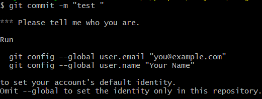
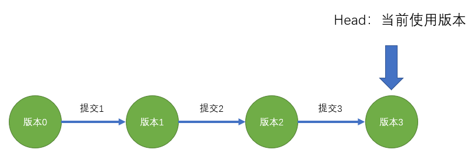
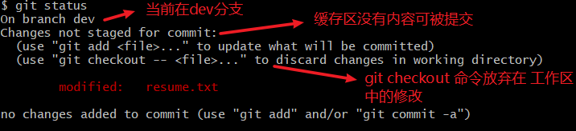
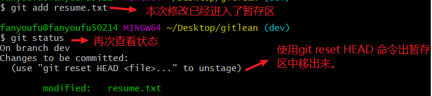
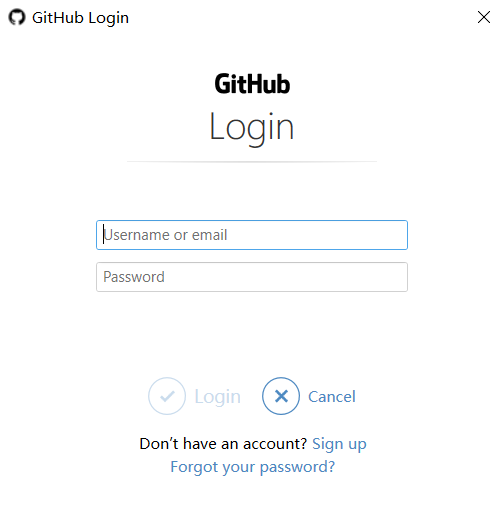
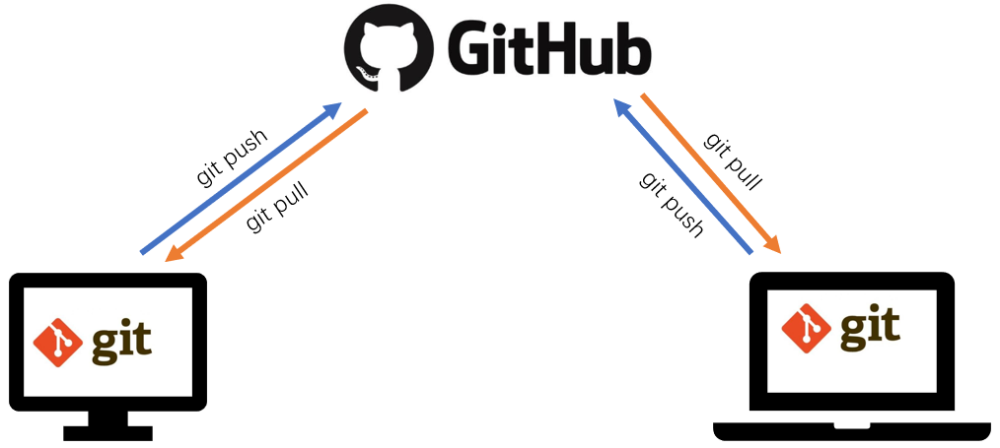
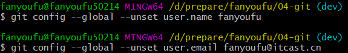

# git讲义

## git的作用

Git 是一种专为处理文本文件而设计的版本控制系统。

### 版本控制

[https://git-scm.com/book/zh/v2/%E8%B5%B7%E6%AD%A5-%E5%85%B3%E4%BA%8E%E7%89%88%E6%9C%AC%E6%8E%A7%E5%88%B6](https://git-scm.com/book/zh/v2/起步-关于版本控制)

什么是“版本控制”？版本控制是一种记录一个或若干文件内容变化，以便将来查阅特定版本修订情况的系统。 

人人都需要版本控制系统，以学生写论文为例：

- 201906011初稿.doc
- 201906013初稿-带目录.doc
- 201906016修正稿-带目录和页码.doc
- 201906018修正稿（导师二次修改）-带目录和页码.doc
- 201906020最终版.doc
- 201906022最终版（导师提了几个要求）.doc
- 201906022最终版（打死不改版）.doc
- 201906023最终版（打印店）.doc
- 201906024最终版（加上参考文献及边距）.doc


其它行业的人，只要涉及到：

- 不断更新某些个文件
- 希望记录更新的某些过程，以便可以回到这个状态

他就会需要使用版本管理软件。


许多人习惯用复制整个项目目录的方式来保存不同的版本，或许还会改名加上备份时间以示区别。 这么做唯一的好处就是简单，但是特别容易犯错。 有时候会混淆所在的工作目录，一不小心会写错文件或者覆盖意想外的文件。


如果这个文件可以被多个共同维护，共同修改的话，我们将会面临更大的挑战。

再如果把这个问题放在程序员的工作中：我们每天都在写代码，就是在修改某些文件，修改的频率还非常高，同时还要与其它小伙伴一起工作。想想，你要如何去管理你的代码，这是一个大问题。


此时，我们就需要有一个专门的版本管理工具来帮我们进行文件版本管理。

### 其它竞品

- git
- svn

## 下载与安装

直接在官网上下载安装包。双击即可安装。

验证是否安装成功：

- 在控制台中：git -v
- 鼠标右键，


## Git的使用方式

- git 命令
  - cmd / powershell
  - git bash
- 图形化界面
  - tortoiseGit
  - sourceTree
  - 开发工具中集成 ( vscode中就有集成的git工具 )

## 基本使用-管理个人简历

### 初始化仓库

在某一个合适的文件夹（建议新建一个空的文件夹，例如：d:/learngit）下，打开git bash，运行如下命令：

`git init`

此时，会多出一个隐藏的文件夹.git。

### 跟踪修改

Git根据文件对文件的修改来进行版本管理，这里的修改包括：新建文件，修改文件内容，删除文件，重命名等操作均属性于修改的范畴。

接下来，我们在d:/learngit下面新建一个文本文件: resume.txt。我们希望使用git来跟踪这个文件的变化过程。

我们要把当前用户的修改添加到git的仓库中去。使用命令：`git add`

​	涉及如下三种命令格式 

- 添加单个文件：`git add yourfilename1.txt`
- 添加多个文件使用空格隔开。 `git add yourfilename1.txt yourfilename2.txx `
- 如果修改的文件很多，可以一次添加全部的文件。`git add .`  注意add后面有一个空格，再接上.

### 提交修改

#### 初次提交，要登记 

第一次使用commit时，会需要你提供一个“身份信息”。这容易理解：我们需要记录下来本次的修改是由谁提供的，无论是论功行赏，或者是秋后算帐都需要要一个名单嘛。



按上面的提示，进行设置用户email和name的设置之后，就可以正常使用了。要注意的是，这里的用户名和email可以是你凭空创造的（不必要与某个网站，或者真正的邮箱去对应起来），但是，为了我们后期使用方便，建议使用一个真正的邮箱地址。

`git config --global user.email "you@example.com"`

`git config --global user.name "yourname"`


当然 ，这个信息也是可以修改的，具体做法是：

1. 删除原信息

   $ git config --global --unset user.name 3333
   $ git config --global --unset user.email 3333@huake.com

2. 重新设置信息。


#### 提交修改

你上面的修改，提交到仓库中。

`git commit`

格式：`git commit -m "内容"`

### 小结

一次init

一次用户登记

多次add,commit

对一个文件的修改而言，每到了一个关键的节点，就可以向版本库中提交一次。


## 版本穿梭

### 理解commit

我们每一次的commit操作都会产生一个新版本，这样不断的叠迭，推动整个代码的开发过程。

其基本示意图如下：




每一次的提交都会有一个commitID。这个commitID是一个永远不会重复的编号，它们可以精确表示每一次的提交。类似于：

>commit 502c563******
>
>commit 53b3430******
>
>commit 6df07d9********

可以通过git log (或者是git log --oneline) 来查看提交日志。

注意，如果提交的记录很长，一屏可能显示不全：

- 需要通过回车来翻页
- 键入`q`可以退出


### git reset

如果我们希望回退到某一个版本，只需要记下它的提交id，再通过git reset 命令来回滚

命令： `git reset --hard commitID`

要注意：

- 复制commitID时，只需要复制前几位（具体几位，并不确定），而不需要复制一个完整的commitID
- 通过鼠标右键进行复制和粘贴操作。


如果你回到了版本2，则再次运行git log，将看不到版本3的commitID，这就好比是你从2019年回到了2000年，你无法看到2000之后到2019之间的提交记录。此时，你可以通过git reflog命令来查看全部的历史记录，然后找到你要回去的版本commitID，再通过git reset --hard commitID来进行版本穿梭。


## 深入git原理

当你通过git init 命令去初始化Git项目之后，你会得到三个工作区域。

### 三个工作区域

- 工作目录

  工作目录是对Git项目的某个版本独立提取出来的内容。 这些从 Git 仓库的压缩数据库中提取出来的文件，放在磁盘上供你使用或修改。它表现成正常的，普通的，我们日常编辑的文件。

- 暂存区（stage）

  暂存区是一个文件，保存了下次将提交的文件列表信息。

- Git 仓库

  记录我们所有的操作记录，它具体会以分支的模式呈现出来。

### 文件的四种状态

通过git status 命令来查看状态。

你工作目录下的每一个文件都不外乎这两种状态：已跟踪或未跟踪。 已跟踪的文件是指那些被纳入了版本控制的文件，在上一次快照中有它们的记录，在工作一段时间后，它们的状态可能处于未修改，已修改或已放入暂存区。 工作目录中除已跟踪文件以外的所有其它文件都属于未跟踪文件，它们既不存在于上次快照的记录中，也没有放入暂存区。 初次克隆某个仓库的时候，工作目录中的所有文件都属于已跟踪文件，并处于未修改状态。

- 未跟踪（untracked）

  没有纳入版本控制的文件。你可以通过 git add 把他们加入Git的监控中。

- 已跟踪

  指那些被纳入了版本控制的文件

  - 已修改（modified）

    表示修改了文件，但还没保存到 Git 仓库中。 对于已经被跟踪的文件，作了修改但还没有放到暂存区域，就是已修改状态。（要与普通文件的操作区分开：你在编辑器中编辑文件时，文件处于正在编辑，如果按下ctrl+s表示已经保存）

  - 已暂存（staged）。

    表示对一个已修改文件的当前版本做了标记，使之包含在下次提交的信息中。如果作了修改并已放入暂存区域，就属于已暂存状态。 

  - 已提交（committed）

    表示数据已经安全的保存在本地Git仓库中。或者是Git 目录中保存着特定版本的文件。

### 基本的 Git 工作流程

1. 在工作目录中修改文件。
2. 暂存文件，将文件的本次修改放入暂存区域。
3. 提交更新，找到暂存区域的文件，将本次修改永久性存储到 Git 仓库。

## 撤销修改-后悔药

Git的工作原理是跟踪文件的修改，我们所做的一切操作：新增，删除，修改，重命名等等都是修改。

在现实生活中，我们没有后悔药可以吃，但在实现的开发过程中，git给我们提供了几种不同功能的后悔药，它的能力要远远强大于我们经常使用的ctrl+z。

### 删除文件

当我们需要删除`暂存区`或`分支`上的文件, 同时工作区也不需要这个文件了, 可以使用  `git rm`命令

```
git rm file_path
git commit -m 'delete somefile'
```

当然，你也可以直接在磁盘上进行删除，并提交这次修改记录。

当我们需要删除`暂存区`或`分支`上的文件, 但本地又需要使用, 只是不希望这个文件被版本控制, 可以使用

```
git rm --cached file_path
git commit -m 'delete remote somefile'
```

### 放弃工作区的修改

文件处于已修改状态，并没有提交到暂存区（即没有运行add）。当然，如果你只是少量的修改代码的话，直接在编辑器中ctrl+z就可以了。但是，如果你修改了很多文件，或者一个文件的修改已经不能通过ctrl+z来还原了，此时，你就可以使用命令：

```
git checkout -- yourfilename.ext
```



### 放弃暂存区的修改

文件处于已暂存状态。即你已经运行了add,但没有commit



命令：git reset HEAD yourfilename.ext  git checkout -- yourfilename.ext

### 从仓库恢复

你已经commit了本次修改，代码也交到了仓库中。此时你有两种选择： 

- 回滚整体版本
- 恢复这一个文件

```
git checkout commitID yourfilename
```

## github

### git和github的关系

git是一个版本管理工具，github提供了一个`网络版本`的代码库，它可以允许你在远程建立git库，这样你就不用担心本地电脑坏掉啦。

你得先在github上申请帐号。接下来，我们看看我们目前的处境：有一个可以建立远程库的github帐号，有一个本地使用的版本管理工具git。下面我们就来介绍一下如何把它们关联起来。

### 基本操作

先创建远程仓库，再克隆到本地

1. 登陆github，创建仓库
2. 在电脑的某个文件夹下，通过git clone到本地。
   - git clone命令会创建一个文件夹
   - git clone命令只需要在第一次时使用
3. 本地正常编辑（修改代码，新建文件等等），提交到本地仓库。
   1. git add .
   2. git commit

4. 推送到远程github





github的补充操作

1. 删除仓库
2. 直接进行代码编辑

### 多人协作



基本操作流程：

1. 在github（或者是公司自己的代码库）上建立仓库

2. 在A电脑上：使用https协议，通过git clone到本地。

   - clone命令会创建一个文件夹
   - clone命令只需要在第一次时使用

3. 在A电脑上：正常本地编辑（修改代码，新建文件等等），提交到本地仓库。

   1. git add .
   2. git commit

4. 在A电脑上：把本地仓库同步到远程github

   git push

5. 在B电脑上：git clone 到本地

6. 拉取：git pull 

   git pull  是从远程拉取最新的代码。（可能在你在本地修改代码时，有另外的同事也在修改代码，所以在提交之间一定要先拉取最新的代码）


## 分支branch


### 使用分支的场景 

现在整个项目处于正常运行的期间，我们只需要进行运维工作就可以了，老大说可以进行小面积的代码重构工作。那你如何保证在不影响现有的代码的情况下，去进行代码重构工作？ 

方法一：整个项目复制出来一份，然后在此基础上进行操作。这种方法是不可行的，你想一想，一旦你完成了重构工作，如何把这个复制出来的项目与原项目进行整合呢？

这里就需要用到分支。

分支可以理解为平行宇宙：在一个宇宙中你是万人瞩目的世界领袖，而另一个宇宙中，你是深陷监牢的大毒枭。你们相互不干扰。

其实，我们一开始使用git就已经处在在分支的概念中了：

- 在github上有分支

- 在每次提交时，也有一个关键字master

### 分支的基本操作

以代码优化为例。对之前的代码进行优化，同时保证老代码能工作。

- 创建新分支

  进行：文件修改,新建文件

- 切换分支
- 合并分支

### 分支的工作原理

图示

### 解决合并分支时的冲突

格式：`git merge 分支名`

把指定的分支名中的代码合并到当前的分支上来。


一般情况下，git会自动帮我们去合并分支，而不会产生冲突。但有些意外的情况，它无法帮助我们合并。一个典型的会产生冲突的场景是：

（1） a分支修改文件1并commit

（2）b分支也修改文件1并commit。

（3）恰好这两个修改`都是修改了同一个地方`（例如：都是修改了某个函数的函数名），则此时，就会出现冲突了。

解决冲突的基本步骤：

1. 打开有冲突的文件。

2. 根据实际情况手动修改（注意去掉冲突时自动加入的特殊符号）

3. 保存修改，并提交

   git commit -a -m ""

补充,如下两个命令可以去：

- git log --graph

- gitk


### 使用分支的基本流程

在项目开发过程中，我们至少会接触三个分支：

- 名为master的主分支

  master分支表示稳定的，可以正常运行的主分支。在我们初始化git时，它就会自动被创建。

- 名为dev的开发分支

  开发中，我们一般会新建一个名为 dev的分支(dev是development的简写，表示开发)，在这个基础上进行开发，测试，然后合并到master分支上。当然了，名字也不一定必须是dev。

- 名为bug的临时分支。

  在项目上线运行之后，用户报出bug时，我们一般会拉出一个新的分支来解决这个bug。 我们假设出bug时一般会附一个bug编号，如1034，此时，我们要去修改代码以解决这个bug，应该怎么做呢？

  ```
  // 从目前分支回到master分支。
  git checkout master
  // 在master分支上拉出新分支,分支名中包含了bug及bug的编号
  git checkout -b bug1034
  // 修改代码，修复bug。希望你可以很顺利地解决这个bug
  // 解决bug之后，回到master分支
  git checkout master
  // 在master分支上合并bug1034分支
  git merge bug1034
  // 准备再次上线 ...
  // 你也可以选择删除这个bug分支
  git branch -d bug1034
  //  回到dev分支，继续开发（搬砖）
  git checkout dev
  ```

  

 我们不会直接在master分支上进行代码开发。在，去做后面的上线操作。而你继续在dev分支上进行后续功能的开发。

在项目上线运行之后，用户报出bug时，一般会附一个有一个bug编号，如1034，此时，我们要去修改代码以解决这个bug，应该怎么做呢？

1. 保存目前手头上在dev分支上的修改

2. 切换到master分支

   - git checkout master

3. 在master分支上拉出新分支，一般的命令是bug加编号。如bug1034。

   	- git checkout -b but1034

4. 在bug1034分支上进行编码，以修改这个bug。修复完成之后，合并到master分支：

   - git checkout master
   - git merge bug1034

5. 确认无误之后，回到dev分支 ，继续开发

    - git checkout dev

      


### 分支命令小结

- 查看分支 

  `git branch`命令会列出所有分支，当前分支前面会标一个`*`号

- 创建分支

  git branch 分支名

- 切换分支

  git checkout 分支名

- 创建并切换

  git checkout -b 分支名

- 合并分支

  git merge 分支名

  把指定的分支名中的代码合并到当前的分支上来。

- 解决冲突

  一般情况下，git会自动帮我们去合并，但有些意外的情况，它无法帮助我们合并，这里就会产生冲突。一个典型的会产生冲突的场景:是a分支修改并commit了文件1,b分支也修改并commit了文件1，恰好这两个修改都是修改了同一个地方（例如：都是修改了某个函数的函数名），则此时，就会出现冲突了。

- 删除分支

  git branch -d 分支名

  如果你在某分支下已经新加入了很多文件，删除分支并不会删除这些文件

- 恢复分支:git branch 分支名 HEAD@{}

  - 通过git reflog来看提交历史，找到 moving from ** to **关键字，以确定head的位置

- 查看所有远程分支

  命令：`git branch -r `

- 本地创建分支，推到远程 

  相当在远程也创建了一个分支

  格式： `git push <远程主机名> <本地分支名>:<远程分支名>`

  示例：`git push origin master:master`

  说明：

  - 远程主机名一般是origin
  - 当你从远程clone下代码之后，在本地会有一个master分支，在远程也会有一个master分支，此时，它们是一一对应的，如果你直接使用 `git push` 也就相当于是 `git push origin master:master`

- 删除远程分支

  格式： `git push <远程主机名> :<远程分支名>`

  示例：`git push origin :dev`

  说明：与创建本地分支并推到远程命令相比，只需要省略本地分支名即可。理解为把本地一个空分支推到远程，间接地实现了删除远程分支的功能。


合并分支中的冲突解决

当Git无法自动合并分支时，就必须首先解决冲突。解决冲突后，再提交，合并完成。

解决冲突就是把Git合并失败的文件手动编辑为我们希望的内容，再提交。

用``命令可以看到分支合并图。

## 补充


### 先有本地代码库，再关联到远程github

如果你先在本地建立了git库，想关联到远程github。你应该这样做：

1. 去github上建立一个与本地代码库同名的代码库。
2. 使用如下命令：

`git remote add origin https://github.com/fanyoufu/04-git.git`

`git push -u origin master`

把本地库的内容推送到远程，用`git push`命令，实际上是把当前分支`master`推送到远程。

由于远程库是空的，我们第一次推送`master`分支时，加上了`-u`参数，Git不但会把本地的`master`分支内容推送的远程新的`master`分支，还会把本地的`master`分支和远程的`master`分支关联起来，在以后的推送或者拉取时就可以简化命令。





你也可以git commit -a -m "提交说明" 来代替上面两句代码了。


背景：每次提交都修改了多个文件。每次提交都会有一个版本号。 

目标：对某一个文件，希望回到某一个版本号，还原这个文件。

方法一：要用到如下三条命令

```
git reset commitID yourfilename.txt
git commit -m ""
git checkout yourfilename.txt
```


方法二：

```javascript
git checkout commitID yourfilename
```


### 资源连接

- [Git 官网](https://git-scm.com/)

- [官方文档](<https://git-scm.com/docs>)

- [GitHub Cheat Sheet](https://github.github.com/training-kit/downloads/github-git-cheat-sheet.pdf)

- [Visual Git Cheat Sheet](http://ndpsoftware.com/git-cheatsheet.html)

- [一个国人写的Git 教程](https://www.liaoxuefeng.com/wiki/896043488029600)

- **[Pro Git](https://git-scm.com/book/zh/v2)**

- [猴子都能懂得 GIT 入门](<https://backlog.com/git-tutorial/cn/>)

- [git游戏](https://learngitbranching.js.org)

  


#### 关于commit内容的说明

有一个清晰合理的commit格式是非常有必要的。下面是一个工具：

```
npm install -g commitizen
```

```javascript
commitizen init cz-conventional-changelog --save-dev --save-exact
```


Git 是一个可安装应用，它允许你对你自己所做的更改进行注释，用以创建易于导航的系统历史。

- **Version Control（版本控制）:** 任何一个能够让你了解文件的历史，以及该文件的发展进程的系统。
- **Git：**一个版本控制程序，通过对变更进行注释，以创建一个易于遍历的系统历史。
- **Commit（提交）：**在指定时间点对系统差异进行的注释 “快照”。
- **Local（本地）：**指任意时刻工作时正在使用的电脑。
- **Remote（远程）：** 指某个联网的位置。
- **Repository (仓库，简称 repo)：**配置了Git超级权限的特定文件夹，包含了你的项目或系统相关的所有文件。
- **Github：**获取本地提交历史记录，并进行远程存储，以便你可以从任何计算机访问这些记录。
- **Push（推送）：**取得本地Git提交（以及相关的所有工作），然后将其上传到在线Github。
- **Pull（拉取）：**从在线的Github上获取最新的提交记录，然后合并到本地电脑上。
- **Master (branch)：主分支，**提交历史 “树”的 “树干”，包含所有已审核的内容/代码。
- **Feature branch（功能分支/特性分支）：**一个基于主分支的独立的位置，在再次并入到主分支之前，你可以在这里安全地写工作中的新任务。
- **Pull Request（发布请求）：**一个 Github 工具，允许用户轻松地查看某功能分支的更改 （the difference或 “diff”），同时允许用户在该分支合并到主分支之前对其进行讨论和调整。
- **Merge（合并）：**该操作**指**获取功能分支的提交，加入到主分支提交历史的顶部。
- **Check out（切换）：**该操作指从一个分支切换到另一个分支。

